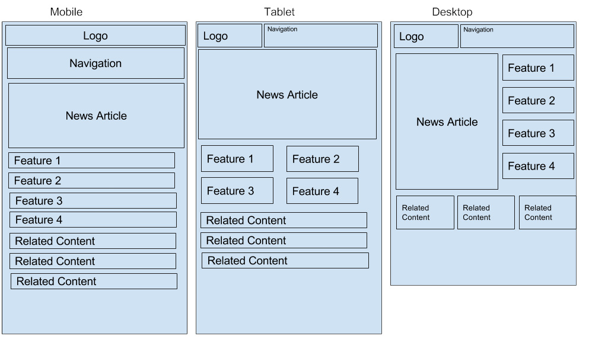

# Let's build a simple responsive framework

We have covered some of the essentials around responsive websites and the Bootstrap framework.  It's time to take what you have learned and apply them to some custom work.

Build a responsive mobile first grid based framework that will meet the following requirements.
- Must have at these 2 resolution media queries 
  - min-width 768
  - min-width 992
- The framework must be able to accommodate the  two wireframes at the bottom of this page.

### Suggestions:
- Plan before you write any code.
- There is no limitation around the number of rules you write.
- Stay organized.
- Write this in a way someone else can use it.
- Look at Bootstrap for inspiration.
- Ask for help if you get stuck.
- Treat this as if it is something you will be using the next 6 months and will make regular updates to.

